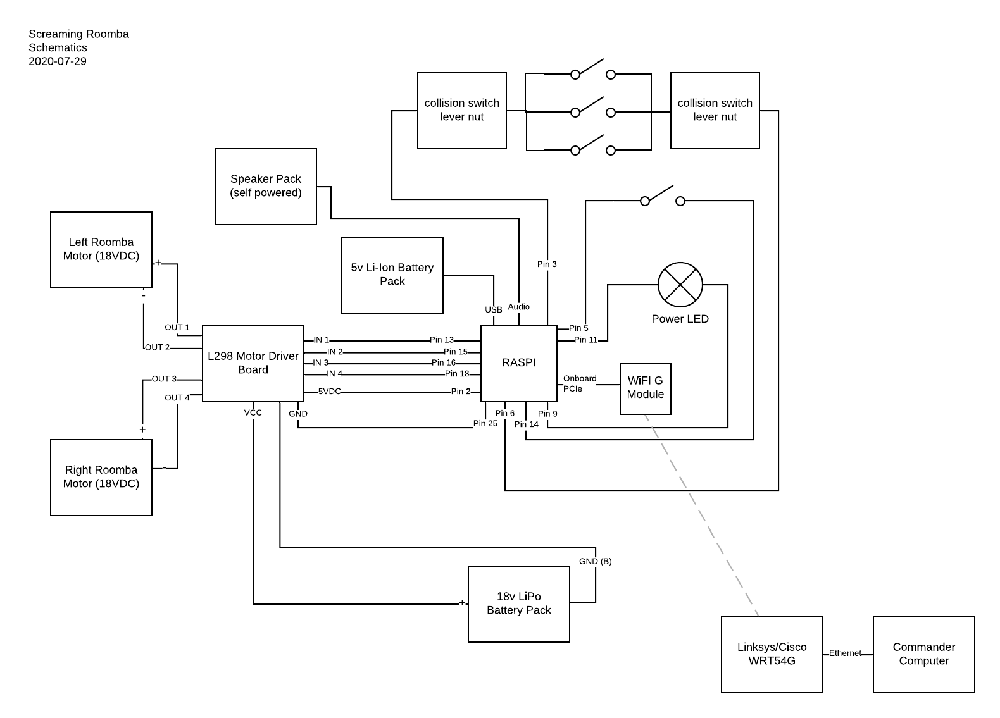
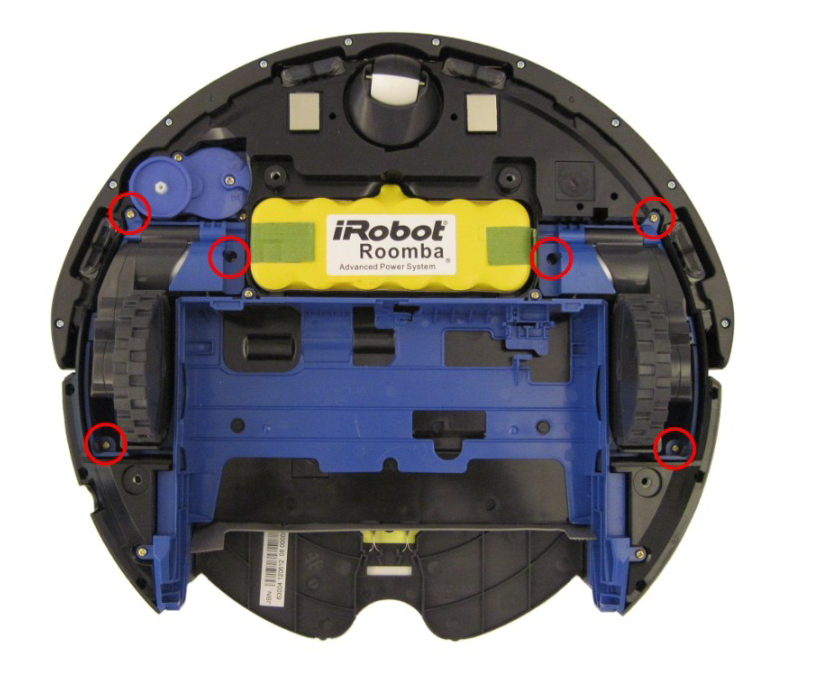

Assembly Guide
==============

.. contents:: :depth: 2

Wiring the Raspberry Pi
-----------------------

*This section is still being written. Contribute?*

Raspberry Pi is ESD-sensitive. Take all necessary precautions, and only perform work at ESD-safe workspaces.

Step 1. Test Raspberry Pi for DOAness
^^^^^^^^^^^^^^^^^^^^^^^^^^^^^^^^^^^^^

We recommend that you test the Raspberry Pi outside of the Roomba, before installation. If you have received a defective or dead-on-arrival part (especially if you bought used), it's best to figure that out now.

Instructions:

1. If there's anything plugged into the Raspberry Pi, unplug it, including the MicroSD card.
2. Using a 5vDC USB-A to USB Micro-B cable, connect the Raspberry Pi's DC input to a standard USB wall wart or computer. If connected to a computer, the computer will only deliver power, no data. The Raspberry Pi can be run off of as small as a 5W AC adapter.
3. As soon as the power cord is connected, the power LED should illuminate on the board and the processor should start to get slightly warm. If none of the components get warm and the LED does not light up, double-check that your wall wart is outputting 5vDC and that your USB-A to USB Micro-B cable is not damaged or broken. If it still doesn't work, you may have gotten a defective or dead-on-arrival part. Stop now.
4. If nothing starts smoking and the Raspberry Pi seems to be working properly, good! Unplug it for now.

Step 2. Getting and Writing a Raspbian Image
^^^^^^^^^^^^^^^^^^^^^^^^^^^^^^^^^^^^^^^^^^^^

Raspbian is a distribution of Linux based on Debian. It has a very Ubuntu-like feel, but doesn't run a lot of background applications, since processor cycles and RAM are at a premium.

Instructions:

1. Go to `the Raspbian download page <https://www.raspberrypi.org/software/>`_ and download the appropriate version of the software for your computer. You can either use the Raspberry Pi imager, which works kind of like the Windows Media Creation Tool, or you can just get the operating system image as an `.iso` disc image file and use a tool like NOOBS to write it.
2. Insert the MicroSD card into the MicroSD to SD adapter, then insert the SD card into your computer's SD card reader. If your SD card is new, you might be prompted to "initialize" or "format" the card. Just ignore this for now.
3. If you're using the Raspberry Pi imaging tool, you can run it now, selecting the SD card as the installation target. If you're using another piece of software to write a disc image to the SD card (like NOOBS), consult that developer's documentation. The goal is to write the OS image to the SD Card, which we can then use.
4. If you are using a Mac and you are prompted whether you'd like to use the storage medium as a Time Machine drive, select Decide Later (NOT Don't Use!), since this doesn't make any other changes to the disk. Windows users need not worry about this.
5. Once your tool of choice has completed the write, eject the disk safely, then remove the SD card from your SD card reader. Remove the MicroSD card from the adapter.

Step 3. Test Raspberry Pi for Bootability
^^^^^^^^^^^^^^^^^^^^^^^^^^^^^^^^^^^^^^^^^

Now that you have a Raspbian image loaded onto your SD card, we can make sure that your Raspberry Pi is functional and that it has networking capabilities.

Instructions:

1. Insert the SD card from Step 2 into your Raspberry Pi's MicroSD card slot.
2. While the power cord is still detached from your Raspberry Pi, connect your HDMI cable to the Raspberry Pi and the other end to a monitor, and connect your USB keyboard and mouse.
3. Now, plug the power back into your Raspberry Pi. It should automatically start booting up. If everything's hunky-dory, you should see the boot sequence on the monitor. If you don't see any output on the display after a few minutes, make sure your HDMI cable is securely connected and that your monitor is working (plugged in with the right input selected). If your monitor is fine, you might have a defective or dead-on-arrival Raspberry Pi.
4. If the boot is successful, you should see options to configure your Raspberry Pi. If you don't see these options, you may have a defective Raspberry Pi or a bad disk image. You can try to rewrite the disk image to the SD card, then reattempt Step 3.
5. Configure your Raspberry Pi according to your preferences. There's nothing too particular here.
6. Once you're presented with the desktop, click on the networking icon in the top-right corner. If you see that there are available networks, great! Now, you can shut down your Raspberry Pi, since we won't need it to be on for a while. If you don't see any networks, use another device to see if there are any WiFi b/g/n networks around. If not, you might not be able to test this yet. If so, you might have a defective wireless chipset on your Raspberry Pi. Regardless, shut down your Raspberry Pi through the operating system.

Step 4. Configure Wiring for Testing
^^^^^^^^^^^^^^^^^^^^^^^^^^^^^^^^^^^^

Instructions:

1. Get your jumper wires ready. We'll mostly use Female-to-Female (F-F) jumpers, but we'll also need some sacrificial F-M (M for Male) jumpers whose male end we'll lop off and strip about 6-8mm of insulation from.
2. Connect a red F-F jumper wire to pin 2 and a black F-F jumper wire to pin 25 of the GPIO headers. This provides +5vDC and floating ground to our motor driver.
3. Connect a sacrificial F-M jumper wire (any color) to pin 3 and connect the other end to a 4-wide lever nut. These will be used to detect collisions from the limit switches.
4. Connect another four F-F jumper wires (any color) to pins 13, 15, 16, and 18. These will be used to control the motor driver.
5. Connect your momentary pushbutton to pin 5 using a sacrificial F-M jumper wire whose male end was soldered onto the common switch lead. Optionally, cover the solder joint with heat shrink tubing. Using a length of wire with bare ends (like primary wire), solder one end to the normally-open switch lead and attach the other end to pin 14.
6. Connect a LED lamp to pin 11 using a F-F jumper wire to the positive end of the lamp and a F-F jumper wire to pin 9 for common.
7. Connect another 4-wide lever nut to another length of wire with bare ends, and connect the other end of the wire to the black wire on pin 6. This, in conjunction with the wire going to pin 3, will give our Roomba collision detection. The other spaces on the 4-wide lever nuts will be taken with leads for the three limit switches.
8. You don't need to use any jumper wire for your speaker. Instead, use a 3.5mm audio cable to connect it to the Raspberry Pi's built-in audio out (typically colored green).

Your Raspberry Pi should look like this. Don't worry about the battery packs or the motor driver.

In summary, you should have jumper wires connected to pins 2, 3, 5, 6, 9, 11, 13, 14, 15, 16, 18, and 25.

- Pin 2 provides +5vDC
- Pin 3 is for collision detection and leads to a 4-wide lever nut
- Pin 5 is for the button
- Pins 6, 9, 14, and 25 are the floating common ground
- Pin 11 is for the LED lamp
- Pin 13 is blank and will be used for the motor driver
- Pin 15 is blank and will be used for the motor driver
- Pin 16 is blank and will be used for the motor driver
- Pin 18 is blank and will be used for the motor driver
- The 3.5mm out is for standard line-level audio output

Step 5. Test Wiring
^^^^^^^^^^^^^^^^^^^

If you have multimeter, you can test your wiring. If not, don't worry about this part. Just double-check your work from Step 4.

Instructions:

1. Power on the Raspberry Pi. You don't need to have any peripherals connected.
2. Test the connection from pin 2 to pin 6. It should read 5v. If it doesn't, something's wrong.
3. Test the connection from pin 1 to pin 6. It should read 3.3v. If it doesn't, the 3.3v rail is not working.
4. Test the impedance from pin 1 to pin 6, 9, 14, and 25 using a low voltage, like 9v, 5v, or 3v. If the impedance is not reasonably low (it should be measured in milli-Ohms, that's how low), something's wrong (burnt out trace?).
5. If all of the voltages are correct and the impedence between all of the ground pins is low, then you should be good to go!

Wiring the Motor Driver
-----------------------

*This section is still being written. Contribute?*

The motor driver is ESD-sensitive. Take all necessary precautions, and only perform work at ESD-safe workspaces.

Step 1. Wire the Motor Driver to the Raspberry Pi
^^^^^^^^^^^^^^^^^^^^^^^^^^^^^^^^^^^^^^^^^^^^^^^^^

Instructions:

1. Locate the jumper wire coming off of the Raspberry Pi from pin 2 and connect it to the motor driver's +5vDC pin.
2. Locate the jumper wire coming off of the Raspberry Pi from pin 25 and connect it to the motor driver's ground pin. Depending on your exact build of motor driver board (some come with a pin and a terminal for ground, others only provide the terminal), you might need to twist it into the ground from the +14/+18vDC battery pack.
3. Locate the jumper wire coming off of the Raspberry Pi from pin 13 and connect it to the motor driver's IN 1 pin.
4. Locate the jumper wire coming off of the Raspberry Pi from pin 15 and connect it to the motor driver's IN 2 pin.
5. Locate the jumper wire coming off of the Raspberry Pi from pin 16 and connect it to the motor driver's IN 3 pin.
6. Locate the jumper wire coming off of the Raspberry Pi from pin 18 and connect it to the motor driver's IN 4 pin.
7. Get a male XT90 pigtail/lead and connect the positive wire to the VCC input and the ground to the ground input. You might need to twist it into the same wire as the lead from pin 25 on the Raspberry Pi. DO NOT CONNECT THE BATTERY PACK YET!
8. Get a black length of wire and connect it to the OUT 2 terminal on the motor driver. Put some electrical tape on the other end for now.
9. Get a black length of wire and connect it to the OUT 4 terminal on the motor driver. Put some electrical tape on the other end for now.
10. Get a red length of wire and connect it to the OUT 1 terminal on the motor driver. Put some electrical tape on the other end for now.
11. Get a red length of wire and connect it to the OUT 3 terminal on the motor driver. Put some electrical tape on the other end for now.

Double-check all of your wiring before continuing!

Step 2. Removing Motors from the Roomba
^^^^^^^^^^^^^^^^^^^^^^^^^^^^^^^^^^^^^^^

The Roomba comes with two motors, which run at a maximum of 18vDC. These motors can be removed easily and are direct-drive DC with an integrated gearbox. The Roomba's motors are enclosed in a protective shell and are not ESD-sensitive.

Instructions:

1. Flip your Roomba over so the wheels are point up.
2. If still present, remove the brush assemblies and dustpan.
3. As shown in the graphic below, remove these three screws. This will loosen the wheel assembly.

4. Wiggle and lift each motor assembly straight out. Remove both the left and right wheel assembly. As you remove each, mark whether it belonged to the left- or right-side of the robot.

Step 3. Wire the Motor Driver to the Motors
^^^^^^^^^^^^^^^^^^^^^^^^^^^^^^^^^^^^^^^^^^^

Your Roomba's motors will run at whatever voltage your battery outputs at. Of note is that the polarity on one of the wheels needs to be reversed for both to move forwards relative to the robot. We are doing this polarity reversal in software, not by the hardware connection.

Instructions:

1. Solder on another red wire to the red wire that corresponds to pin A on the wheel assembly's PCB. We need to use this terminal to drive the motor. Do the same thing for the other motor assembly.
2. Solder another black wire to the black wire that corresponds to pin B on the wheel assembly's PCB. We need to use this terminal to drive the motor. Do the same thing for the other motor assembly.
3. For your left motor, solder the other end of the red wire that you just attached to the motor to the OUT 1 wire from the motor driver.
4. For your left motor, solder the other end of the black wire that you just attached to the motor to the OUT 2 wire from the motor driver.
5. For your right motor, solder the other end of the red wire that you just attached to the motor to the OUT 3 wire from the motor driver.
6. For your right motor, solder the other end of the black wire that you just attached to the motor to the OUT 4 wire from the motor driver.
7. You can ignore the 5V, ENC, WD, and GND pins on the wheel PCB - these are connected to hall effect sensors that can detect if the robot has been picked up, but we don't use them here.

Installing Components into the Roomba
-------------------------------------

*This section is still being written. Contribute?*
